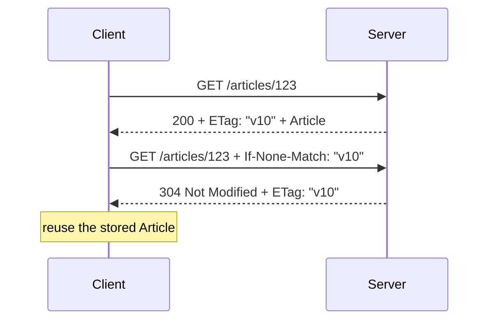

# Conditional GET and revalidation

Status: proposed opt-in pattern.

## 1. Pattern overview

A conditional GET lets a client ask for a representation only when it changed.
The server returns the current body and an entity tag on the first request. A
later request sends that tag in `If-None-Match`; the server answers `304 Not
Modified` without a body when the selected representation is still equivalent.



The semantics come from
[RFC 9110 conditional requests](https://www.rfc-editor.org/rfc/rfc9110.html#name-conditional-requests)
and [RFC 9111 cache validation](https://www.rfc-editor.org/rfc/rfc9111.html#name-validation).
This pattern saves transfer and parsing; it is not itself a freshness policy or
a complete HTTP cache.

## 2. HTTP contract

```text
GET resource
If-None-Match: optional entity-tag list or *

200
ETag: required by this profile
body: Resource

304
ETag: required by this profile
body: absent
selected 304 metadata updates the stored representation metadata
```

RFC 9110 allows weak comparison for `If-None-Match`, so both strong tags
(`"v10"`) and weak tags (`W/"v10"`) are useful. The tag identifies one selected
representation, not merely a database row. Content negotiation matters: an
English JSON representation and a Japanese JSON representation can have
different tags, and a cache key must honor `Vary`.

The RFC defines which metadata a generated `304` must carry when it would have
appeared on the corresponding `200`. NE's initial profile requires `ETag` on
both branches and leaves full RFC 9111 metadata merging to the strategy.

## 3. Server-side API proposal

The low-level contract is explicit:

```ts
export default defineRouteHandler({
  conditionalGet: { validator: 'etag', status: 200 },
  validate: {
    headers: z.object({
      'if-none-match': z.string().optional(),
    }),
    response: {
      200: { body: Article, headers: { etag: EntityTag } },
      304: { body: z.undefined(), headers: { etag: EntityTag } },
    },
  },
  handler: async (event) => {
    const article = await readArticle(event.validated.params.id)
    const etag = strongEtag(article.version)
    return event.conditional(etag, () => article)
  },
})
```

The exact `conditionalGet` and `event.conditional` names are proposals.
`event.conditional` is justified because parsing entity-tag lists, choosing
weak comparison, producing a bodyless `304`, and retaining required headers are
easy to implement incorrectly. It remains a helper over visible `200`/`304`
branches, not a new RPC result.

The handler supplies a cheap application validator when possible. Hashing a
fully serialized response after the handler runs is convenient but can buffer
large bodies, duplicate work, and produce unstable tags. It should be an
optional middleware path limited to buffered representations, similar to
[Hono's ETag middleware](https://github.com/honojs/hono/blob/main/src/middleware/etag/index.ts),
not the core contract.

## 4. Server conformance

TypeScript can require:

- a GET/HEAD-capable endpoint;
- one successful body branch with an `ETag` response-header schema;
- a bodyless `304` branch with an `ETag` schema;
- an optional `If-None-Match` request header;
- a helper result limited to those declared branches.

Runtime code must parse entity-tag syntax and comma-separated lists, handle
`*`, perform weak comparison, and emit the correct metadata. A constructor can
ensure tags are quoted and reject control characters. Build/runtime checks must
not treat an arbitrary unquoted version string as a valid wire tag.

Types cannot prove that a tag changes whenever a representation changes, that
it varies by every negotiated dimension, or that a supplied database version
describes the final serialized representation. Those are server invariants.

## 5. Client-side raw usage

```ts
const first = await $endpoint('/api/articles/:id', {
  method: 'get',
  params: { id },
})

if (first.status === 200) {
  const etag = first.headers.get('etag')
  const next = await $endpoint('/api/articles/:id', {
    method: 'get',
    params: { id },
    headers: { 'If-None-Match': etag! },
  })

  if (next.status === 304) {
    // reuse first.body
  }
}
```

The `304` body narrows to `undefined`. Raw use deliberately makes the caller
own the previous representation.

## 6. Invocation Strategy

The strategy needs a representation record keyed by the complete request
variant:

```ts
type ValidatedRepresentation<T> = {
  value: T
  etag: string
  responseMetadata: Record<string, string>
}
```

On the first call it stores the `200` body, tag, and relevant metadata. On a
later call it adds `If-None-Match`. A `200` replaces the record. A `304` updates
the metadata required by RFC 9111 and returns the previous `value`. To its
caller, both successful paths resolve as `T`.

The key must include path params, query, `Accept`, and every field named by
`Vary`; credentials must at least partition server-side state by request. A
module-global map is unsafe during SSR. A malformed `304` without a known prior
representation is a protocol error, not `undefined` data.

Only endpoints carrying the conditional-GET capability may construct the
strategy. This does not aim to implement freshness, eviction, heuristic caching,
`stale-if-error`, or shared-cache rules.

## 7. Pinia Colada integration

Colada should own the cached value and freshness schedule. NE needs to retain
the ETag beside the matching cache entry and turn `304` into the existing value
before resolving the query promise.

There are two viable spikes:

1. Cache an internal serializable `{ value, etag, metadata }` page and expose a
   computed `value` through a small adapter.
2. Store only serializable validator metadata in Colada's entry `meta`, while
   reading/writing the value through the query cache.

The current NE Colada query projection drops headers, so neither happens by
accident. The proposed external adapter spells the basic projection as
`queryOptions(request)`.
Do not retain tags in a closure shared across SSR requests. Colada owns refetch
timing; the conditional strategy only changes what that refetch sends and how
it interprets `304`.

## 8. Existing implementations

- RFC 9110 defines entity tags, weak/strong comparison, precondition order, and
  `304`; RFC 9111 defines cache selection, `Vary`, validation, and metadata
  updates.
- TypeSpec HTTP can bind `ETag` and `If-None-Match` headers. Azure TypeSpec's
  `SupportsConditionalRequests` trait groups conditional request headers and
  ETag response metadata for generated clients.
- Hono's ETag middleware hashes buffered response bodies, compares
  `If-None-Match`, and retains a defined header set on `304`; it is runtime
  middleware, not a typed invocation strategy.
- Misina's cache plugin implements a larger RFC 9111 cache including ETag,
  Last-Modified, `Vary`, Cache-Control, and stale extensions. That scope is
  deliberately too large for NE's first conditional strategy.
- OpenAPI and ts-rest can describe the two responses and headers but do not
  standardize revalidation state management.
- Smithy can bind the fields but has no core ETag revalidation behavior trait.

## 9. Recommendation

| Criterion          | Assessment                                                   |
| ------------------ | ------------------------------------------------------------ |
| Frequency          | Medium-high for read-heavy resources                         |
| HTTP-native value  | Very high; standardized cache validator semantics            |
| Type-safety value  | High for bodyless 304 and required header correlation        |
| Server DX          | Medium; stable validator generation is application-specific  |
| Client DX          | High when previous-value plumbing disappears                 |
| Colada integration | High but requires correct SSR-safe metadata ownership        |
| Complexity         | Medium-high once `Vary` and hydration are respected          |
| Alternatives       | Browser/proxy HTTP cache, Hono middleware, full HTTP clients |

**Priority: Medium.** Prototype in NE after cursor pagination. Keep it opt-in
and explicitly smaller than a full RFC 9111 cache.
