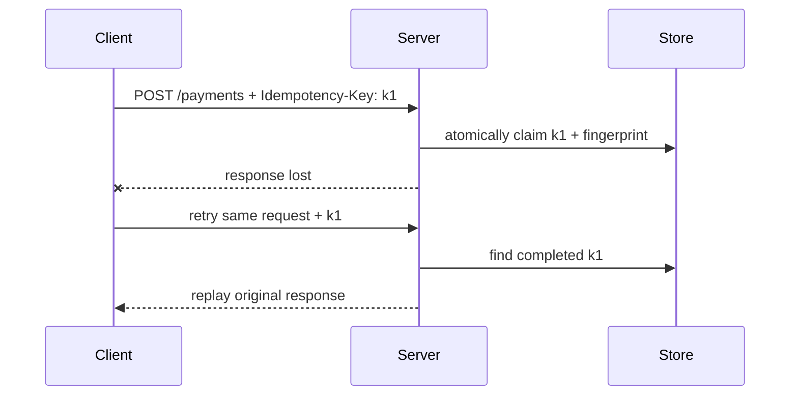

# Idempotent mutation and safe retry

Status: implemented NE pattern with adapter work remaining.

## 1. Pattern overview

An idempotency key lets a client retry one logical mutation without creating a
second side effect when the first response was lost or timed out. Typical uses
include payment creation, job submission, and additive commands that do not
have a natural application uniqueness key.



The current reference is
[`draft-ietf-httpapi-idempotency-key-header-07`](https://datatracker.ietf.org/doc/html/draft-ietf-httpapi-idempotency-key-header-07).
It expired on 2026-04-18 and is not an RFC. NE's durable semantics are specified
in [the existing idempotency design](../idempotency.md).

## 2. HTTP contract

```text
unsafe mutation method (normally POST or PATCH)
Idempotency-Key: one opaque client key per logical invocation

first request        -> ordinary declared response
completed duplicate  -> replay equivalent recorded response
concurrent duplicate -> 409 Problem Details
same key/new payload -> 422 Problem Details
required key missing -> 400 Problem Details
```

The lookup identity includes endpoint, trusted server scope, and key. A
fingerprint binds the key to validated request input. Expiry policy is part of
the published service contract. The key is not authentication and must not let
one principal replay another principal's response.

Exactly-once external effects are not guaranteed. A process can perform an
external effect and fail before completing the replay record. Downstream
idempotency, an outbox, or a domain uniqueness constraint is still required.

## 3. Server-side API proposal

NE already has the intended split:

```ts
export default defineRouteHandler({
  idempotency: {
    enabled: true,
    required: true,
  },
  validate: {
    body: CreatePayment,
    response: { 201: Payment },
  },
  handler: (event) => event.respond(201, createPayment(event.validated.body)),
})
```

Static policy remains in the contract. Runtime-only storage, authorization
scope, fingerprint projection, leases, and TTLs remain in
`server/endpoints/runtime.ts`. This separation prevents build-time contract
evaluation from executing database callbacks.

No additional `defineIdempotentEndpoint` wrapper is needed. Domain idempotency
with a database uniqueness constraint should remain the preferred paved road
when a natural key exists.

## 4. Server conformance

TypeScript can constrain the feature to supported mutation methods, carry the
header name/required flag into generated clients, and reject runtime callbacks
from the static contract. It can add the framework `400`, `409`, and `422`
branches to the client result.

Runtime code must validate the header, calculate the fingerprint, atomically
claim storage, fence leases, detect mismatched payloads, record a replay-safe
response, and authorize the replay scope. Storage conformance tests—not
structural TypeScript alone—establish atomic behavior. Application code remains
responsible for external effects and durable deployment configuration.

## 5. Client-side raw usage

```ts
const request = $endpoint('/api/payments', {
  method: 'post',
  body: { amount: 1000 },
})

const first = await request
const retry = await request // the same logical request reuses one key

if (retry.status === 409) {
  retry.body // typed idempotency Problem Details
}
```

A caller can supply an explicit `idempotencyKey` when the logical operation
identity comes from outside NE. Attempt identity must never be regenerated by a
transport retry.

## 6. Invocation Strategy

The strategy owns one logical mutation request:

- generate or accept one key exactly once;
- retain the canonical request/fingerprint-relevant input;
- reuse the same key across transport and policy retries;
- create a new key for a new user action;
- stop on permanent declared responses and expose them unchanged.

The endpoint type must prove that the server declares idempotency before an
unsafe mutation is marked safe for automatic retry. HTTP-idempotent methods do
not require this key merely to be retried, although response replay may still
be an application feature.

The current fixed request object has correct key lifetime. The remaining design
gap is dynamic mutations: `mutation(body)` needs a new request/key per Colada
invocation but the same request/key for every retry of that invocation.

## 7. Pinia Colada integration

Colada should own retry scheduling and mutation state. NE should own request
identity. The adapter therefore needs an invocation-scoped request factory,
not a module-global key and not a request factory re-run on every attempt.

The current `mutationOptions(request)` adapter from `#endpoints/colada` is safe
for a prebuilt request with fixed input.
For variable input, the future adapter must establish a logical invocation
boundary and pass a retryable closure holding the already-created request. If
Colada's retry plugin cannot preserve that boundary through its public hooks,
NE must document the limitation rather than add a competing hidden retry loop.

## 8. Existing implementations

- The expired IETF draft specifies key responsibilities, optional fingerprint,
  replay, and `400`/`409`/`422` error guidance.
- Smithy's `idempotencyToken` trait identifies a request member, permits clients
  to generate it automatically, and treats the token-bearing operation as safe
  to retry. Smithy also distinguishes `readonly`, `idempotent`, and `retryable`.
- Azure TypeSpec's `SupportsRepeatableRequests` uses
  `Repeatability-Request-ID`, `Repeatability-First-Sent`, and
  `Repeatability-Result`, reflecting the OASIS/Azure convention rather than the
  IETF header.
- AWS service guidance widely uses client tokens and requires the same token
  and parameters across retries.
- Misina generates one key per logical client call and reuses it across its own
  retry loop. It does not provide NE's server replay store/state machine.
- Hono and ts-rest can carry the header but do not define a complete portable
  replay contract.

## 9. Recommendation

| Criterion          | Assessment                                                             |
| ------------------ | ---------------------------------------------------------------------- |
| Frequency          | Medium; critical for selected mutation classes                         |
| HTTP-native value  | High, with the caveat that the IETF document is expired                |
| Type-safety value  | High for safe-retry capability and static/runtime separation           |
| Server DX          | High once durable storage is configured                                |
| Client DX          | High for fixed requests; incomplete for dynamic variables              |
| Colada integration | High when retry is enabled                                             |
| Complexity         | High because correct storage is a distributed state machine            |
| Alternatives       | Domain uniqueness, provider-specific idempotency, transactional outbox |

**Priority: High.** Keep the existing feature in NE core. Do not redesign it as
part of the new-pattern MVP. Treat dynamic Colada mutation identity as a focused
follow-up with failure-before-fix tests.
