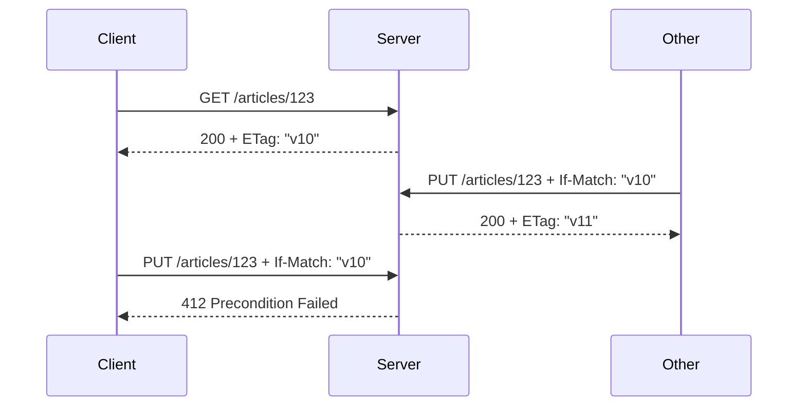

# Optimistic concurrency with ETag and If-Match

Status: proposed optional pattern.

## 1. Pattern overview

Optimistic concurrency prevents a client that edited an old representation
from silently overwriting a newer change. A read returns a strong entity tag.
The client sends it with a later write in `If-Match`; the server performs the
write only if the selected representation still has that tag.



This is the “lost update” use case in
[RFC 9110](https://www.rfc-editor.org/rfc/rfc9110.html#name-if-match).
[RFC 6585](https://www.rfc-editor.org/rfc/rfc6585.html#section-3) adds `428
Precondition Required` for a server that refuses an unconditional write.

## 2. HTTP contract

Read side:

```text
GET resource
200 + body + strong ETag
```

Write side:

```text
PUT/PATCH/DELETE resource
If-Match: required strong entity-tag (or * when explicitly supported)

success -> updated representation or no content, normally a new ETag
mismatch  -> 412 Precondition Failed, no mutation performed
missing   -> 428 Precondition Required when the profile requires a condition
```

`If-Match` uses strong comparison. A weak tag beginning with `W/` never
satisfies it. Authentication/authorization errors can take precedence according
to application policy; the contract must not leak resource existence through a
precondition check.

The critical invariant is atomicity: compare the validator and commit the
write as one storage operation or transaction. Reading, comparing in
JavaScript, then issuing an unconditional update has a time-of-check/time-of-use
race and does not satisfy the contract.

## 3. Server-side API proposal

The low-level write contract remains ordinary HTTP:

```ts
export default defineRouteHandler({
  optimisticConcurrency: { validator: 'etag', required: true },
  validate: {
    headers: z.object({ 'if-match': EntityTag }),
    body: UpdateArticle,
    response: {
      200: { body: Article, headers: { etag: StrongEntityTag } },
      412: { body: PreconditionFailed, contentType: 'application/problem+json' },
      428: { body: PreconditionRequired, contentType: 'application/problem+json' },
    },
  },
  handler: async (event) => {
    const result = await articles.updateIfVersionMatches({
      id: event.validated.params.id,
      ifMatch: event.validated.headers['if-match'],
      patch: event.validated.body,
    })
    return result.matched
      ? event.respond(200, result.article, { headers: { etag: result.etag } })
      : event.respond(412, preconditionFailed())
  },
})
```

A helper should parse/normalize `If-Match` and construct standard `412`/`428`
responses, but it must pass the condition into application storage. A generic
middleware that reads the resource before the handler and later permits an
unconditional write would offer false safety.

An optional static relation may identify the read endpoint that supplies the
tag. Do not require CRUD names or infer the relation solely from matching paths.

## 4. Server conformance

TypeScript can require a request-header contract, `412`, optional `428`, and a
successful response. A cross-endpoint relation can check that the read branch
declares a strong ETag and that the write accepts the same wire tag.

Runtime helpers can validate entity-tag grammar, reject weak tags for
`If-Match`, apply `*` semantics, and prevent the handler from returning success
through the helper after an explicit mismatch result.

Neither TypeScript nor NE middleware can prove storage atomicity. The storage
adapter/handler must return an explicit matched/mismatched result from an atomic
conditional update, and integration tests must exercise concurrent writers.

## 5. Client-side raw usage

```ts
const current = await $endpoint('/api/articles/:id', {
  method: 'get',
  params: { id },
})

if (current.status === 200) {
  const updated = await $endpoint('/api/articles/:id', {
    method: 'put',
    params: { id },
    headers: { 'If-Match': current.headers.get('etag')! },
    body: edit,
  })

  if (updated.status === 412) {
    // show a conflict, refetch, or offer a merge
  }
}
```

Raw use makes validator provenance visible. The `412` body remains a declared,
typed branch rather than an unknown thrown error.

## 6. Invocation Strategy

The minimum strategy is not a CRUD client. It carries one validator from a
known representation into one conditional request:

```text
input: versioned representation + write request factory + new body
request transform: set If-Match to the representation's strong ETag
success: return the write's status-aware success
412: return a typed conflict result retaining the attempted and current identity
```

Only a write endpoint carrying the optimistic-concurrency capability may be
adapted. Automatic composition with a read endpoint additionally requires a
declared relation and a validator-bearing representation type.

The strategy must never retry `412`; it is a semantic conflict, not a transient
failure. It may help refetch after conflict, but merging is application logic.

## 7. Pinia Colada integration

Colada is valuable for holding the read representation, mutation state,
optimistic UI, and invalidation. The application's standard `defineQuery`
composition can expose a domain API without an NE `useResource` wrapper:

```ts
const useArticle = defineQuery(() => {
  const read = useQuery(/* NE read strategy/options */)
  const write = useMutation(/* NE If-Match strategy/options */)
  return { ...read, update: write.mutateAsync }
})
```

The adapter must retain the ETag in an SSR-safe representation sidecar keyed
with the same Colada entry. A `412` should be returned or exposed as a typed
conflict state; Colada's generic retry plugin must not retry it. Colada owns
optimistic cache rollback and subsequent invalidation.

## 8. Existing implementations

- RFC 9110 specifies strong `If-Match` comparison and precondition evaluation
  order. RFC 6585 defines `428` for APIs requiring conditional writes.
- Azure TypeSpec groups ETag request/response fields in
  `SupportsConditionalRequests`, and Azure SDK generators expose match
  conditions. This proves value in describing the capability beyond raw
  headers.
- Google AIP-154 also models freshness tokens, but commonly places `etag` in
  resource/request bodies and maps mismatch to RPC `ABORTED`/HTTP 409. That is a
  different profile from the HTTP-native `If-Match`/`412` design proposed here.
- TypeSpec HTTP, OpenAPI, Smithy, Hono, and ts-rest can bind the individual
  headers/statuses. They do not prove atomic application storage updates.
- Hono's built-in ETag middleware handles `If-None-Match` revalidation, not
  conditional mutation.

## 9. Recommendation

| Criterion          | Assessment                                                 |
| ------------------ | ---------------------------------------------------------- |
| Frequency          | Medium; high in admin/editing and inventory systems        |
| HTTP-native value  | Very high; exact standardized lost-update semantics        |
| Type-safety value  | High for read/write capability composition                 |
| Server DX          | Medium; honest API must expose storage atomicity           |
| Client DX          | High when ETag transport is automatic                      |
| Colada integration | High for resource editing workflows                        |
| Complexity         | Medium-high, mainly relation/state ownership and atomicity |
| Alternatives       | Version field in body, database-specific compare-and-swap  |

**Priority: Medium.** Make it an optional core capability after conditional GET
establishes typed representation metadata. Do not claim conformance without an
atomic application update API.
