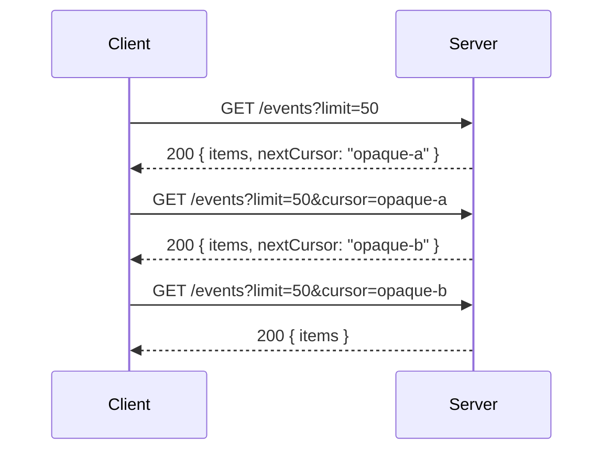

# Cursor pagination

Status: implemented first vertical slice on the Nuxt 5 development line.

## 1. Pattern overview

Cursor pagination bounds a collection response and lets the server describe
where the next request should continue. It is useful for feeds, audit logs,
search results, and any collection that can grow or change while a caller is
reading it. Unlike offset pagination, the cursor is an opaque continuation of
the server's ordering state rather than a client-computed row number.



There is no general HTTP pagination RFC. Two established families exist:

- an opaque cursor in a request/response field, as standardized at the API
  description level by [TypeSpec pagination](https://typespec.io/docs/standard-library/pagination/),
  [Smithy's `paginated` trait](https://smithy.io/2.0/spec/behavior-traits.html#paginated-trait),
  and [Google AIP-158](https://google.aip.dev/158);
- a server-provided link, commonly `Link: <...>; rel="next"`, using
  [RFC 8288 Web Linking](https://www.rfc-editor.org/rfc/rfc8288.html).

The MVP should implement body/query cursor pagination. `Link` pagination can be
added later because it needs typed response-header state and safe URL following.

## 2. HTTP contract

Initial profile:

```text
GET collection-route
query.cursor: optional opaque string
query.limit: optional integer from 1 to 100 (defaults to 20 after validation)

200
body.items: array
body.nextCursor: optional opaque string
```

The declaration identifies:

- one GET operation;
- one successful status, initially exactly `200`;
- the schema of one item. NE owns the default top-level protocol members
  `cursor`, `limit`, `items`, and `nextCursor`.

The input cursor must be optional for the first request. The output cursor must
be optional or nullable to represent the end. Its non-null type must be
assignable to the input cursor type. The original params and non-cursor query
fields remain unchanged across pages.

Runtime invariants that a schema cannot establish include stable ordering,
authorization on every page, no duplicate items, and whether a cursor actually
belongs to the same filters. Cursors should be opaque and versioned. They must
not grant authorization. Google and Smithy both warn against exposing cursor
internals; Google also requires the non-cursor arguments to remain consistent.

## 3. Server-side API proposal

The pagination declaration is the only source of truth for the generated
query and successful page response:

```ts
export default defineRouteHandler({
  pagination: {
    kind: 'cursor',
    item: Event,
  },
  handler: async (event) => {
    const page = await listEvents(event.validated.query)
    return page
  },
})
```

This constructs `query: { cursor?: string, limit?: number }` for callers,
normalizes the handler input to `{ cursor?: string, limit: number }`, and
constructs response 200 as `{ items: Event[], nextCursor?: string }`.

Additional filters and non-200 responses may still use `validate`, but the
generated fields may not be repeated:

```ts
validate: {
  query: z.object({ category: z.string().optional() }), // combined
  response: { 404: Problem },                           // combined
}
```

Declaring `validate.query.cursor`, `validate.query.limit`, or
`validate.response[200]` is an error even if the duplicate schema happens to
agree today. There is no precedence rule. TypeScript reports it early, and
build discovery repeats the check for JavaScript and cast paths.

A `page(items, nextCursor)` helper adds little while schemas already validate
the returned object. Do not add `definePaginatedEndpoint`. A future helper is
justified only if it generates opaque signed cursors or prevents repeated
server plumbing; encoding policy belongs to the application runtime, not static
contract metadata.

## 4. Server conformance

TypeScript can check:

- the handler returns the generated page envelope;
- every item conforms to the declared item schema output;
- the cursor and limit have the generated request types;
- pagination-owned fields/statuses are not duplicated in `validate`;
- `infiniteQueryOptions()` receives a GET request carrying pagination
  capability.

The route filename supplies the HTTP method on a single-method file, so a
build-time contract diagnostic—not the local object type—must reject pagination
on a non-GET route. Multi-method definitions can reject it directly on a
non-GET member.

The generated validators parse `limit`, validate every item with the declared
item schema, and validate `nextCursor`. They cannot prove global ordering,
uniqueness, cursor expiry, filter binding, or authorization; those remain
application responsibilities.

## 5. Client-side raw usage

Raw status-aware use remains possible without a strategy:

```ts
const first = await $endpoint('/api/events', {
  method: 'get',
  query: { limit: 50 },
})

if (first.status === 200 && first.body.nextCursor) {
  const second = await $endpoint('/api/events', {
    method: 'get',
    query: { limit: 50, cursor: first.body.nextCursor },
  })
}
```

The response cursor is already typed by the response schema and the next query
by the input schema. The pattern metadata adds the relation that tells tooling
which fields play those roles.

## 6. Invocation Strategy

The framework-neutral strategy owns one traversal:

- the original request params/query except for the cursor;
- the current cursor and a set of previously seen cursors;
- an abort signal and optional maximum page/item count;
- the mapping from a successful page to `items` and `nextCursor`.

For each page it copies the base request, inserts the current cursor, invokes
the endpoint, and returns the typed page. Missing/null cursor terminates.
Repeating a cursor fails with a protocol error rather than looping forever.
This cycle guard is an important lesson from
[Misina's paginator](https://github.com/productdevbook/misina/blob/main/src/paginate/index.ts).

The strategy must preserve declared non-success responses. The implemented API
returns a page only for status 200 and throws a typed
`EndpointPaginationError` carrying the complete status-aware `result`
otherwise. A failure before an HTTP response uses the same error with no
`result`. Do not erase `401`, `429`, or transport failures into “no more
pages”.

Only an endpoint type carrying the cursor-pagination capability may construct
this strategy. That constraint is the main value over a handwritten loop.

## 7. Pinia Colada integration

Pinia Colada already provides
[`useInfiniteQuery`](https://pinia-colada.esm.dev/guide/infinite-queries.html)
with `initialPageParam`, `query({ pageParam })`, and `getNextPageParam`. NE should
map the contract directly to those options:

```ts
import { useInfiniteQuery } from '@pinia/colada'
import { infiniteQueryOptions } from '#endpoints/colada'

const request = $endpoint('/api/events', {
  method: 'get',
  query: { limit: 50 },
})

const events = useInfiniteQuery(infiniteQueryOptions(request))
```

`infiniteQueryOptions()` is imported from `#endpoints/colada` and should accept
only a request whose generated route metadata proves the pagination contract.
It should:

- use `undefined` as the initial cursor;
- insert Colada's `pageParam` into the mapped query member;
- return the successful page body;
- read the mapped next member in `getNextPageParam`;
- build one cache key from the base request while deliberately excluding the
  changing cursor;
- retain Nuxt's SSR request-aware fetcher exactly as the existing Colada query
  projection does.

Colada owns page storage, SSR serialization, `maxPages`, loading state, and
when `loadNextPage()` runs. NE owns only HTTP field mapping and request
construction. Do not add `useEndpointPagination` and do not make NE maintain a
second page cache.

## 8. Existing implementations

- TypeSpec marks page items, continuation-token input/output, and next links as
  explicit semantic roles. It permits the token in a body or header and says
  next links should be treated as opaque URLs.
- Smithy's `paginated` trait maps `inputToken`, `outputToken`, `items`, and
  `pageSize`; generated clients should offer automatic iteration. It requires
  opaque, preferably versioned tokens and documents mutation-during-pagination
  behavior.
- Google AIP-158 standardizes `page_size`, `page_token`, and
  `next_page_token`, makes pagination an up-front compatibility decision, and
  treats an empty next token as the only end marker.
- OpenAPI can describe the fields but has no standard pagination semantic. A
  Link Object can relate operations, but client generator behavior varies.
- Misina supports either `Link: rel=next` or an application `next` callback and
  includes request/page limits and URL+init cycle detection. It owns a whole
  HTTP client, so NE should copy the edge-case lessons, not depend on it.
- Hono and ts-rest type the underlying request and response shapes but do not
  give these fields a portable pagination role.

## 9. Recommendation

| Criterion          | Assessment                                                                 |
| ------------------ | -------------------------------------------------------------------------- |
| Frequency          | High for feeds, search, logs, and collection APIs                          |
| HTTP-native value  | Medium; cursor fields are ecosystem convention, Link is standardized       |
| Type-safety value  | High because input/output compatibility and item extraction are relational |
| Server DX          | High with one small static mapping                                         |
| Client DX          | High; removes repeated cursor wiring                                       |
| Colada integration | Very high; maps directly to its infinite-query primitive                   |
| Complexity         | Medium-low for top-level cursor fields                                     |
| Alternatives       | Handwritten `useInfiniteQuery`; OpenAPI generators with vendor conventions |

**Priority: High.** Put the static capability and framework-neutral page
strategy in NE core, and expose Pinia Colada options only when Colada is
installed. This is the recommended first new implementation. Do not include
Link-header pagination, a cursor codec, or another HTTP pattern in the MVP.
