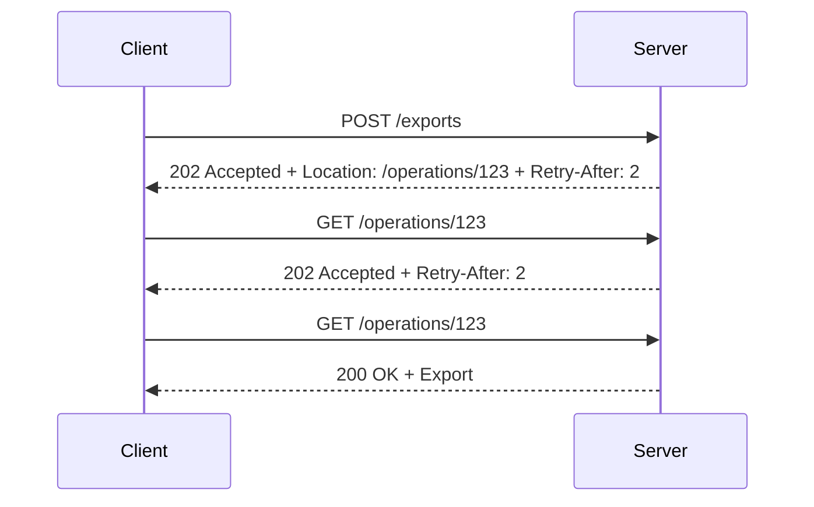

# Async operation and polling

Status: proposed pattern, deferred until endpoint relations are proven.

## 1. Pattern overview

Some operations cannot finish within one request. The server acknowledges that
work started and gives the client a resource to monitor. The client follows
that location until the operation completes, fails, is canceled, or exceeds a
caller deadline.



[RFC 9110](https://www.rfc-editor.org/rfc/rfc9110.html#name-202-accepted)
defines `202` as intentionally noncommittal and recommends a representation
describing status and a monitor. It does not require `Location`. This document
defines a stricter NE profile: `202 + Location` identifies a linked monitor
operation. `Retry-After` uses RFC 9110's HTTP-date or integer-seconds syntax.

## 2. HTTP contract

Trigger operation:

```text
POST/PUT/PATCH/DELETE trigger
202 + Location (required) + optional Retry-After
optional immediate completion branch (200/201/204)
```

Monitor operation:

```text
GET concrete Location
202 + optional Retry-After while pending
200 + FinalResult when complete
declared terminal error/problem branches when failed or canceled
```

The static contract must relate the trigger to one monitor endpoint and define
which monitor statuses mean pending, success, and failure. The `Location`
value supplies concrete parameters at runtime and must resolve to the declared
route. Its lifetime/expiry and behavior after completion must be documented.

This profile does not require a proprietary `{ state: "PENDING" }` body. An API
may additionally expose progress in a typed monitor body, but the HTTP status
and relation remain visible.

## 3. Server-side API proposal

Two ordinary route contracts are the low-level API. The trigger adds a static
relation:

```ts
export default defineRouteHandler({
  polling: {
    monitor: { path: '/api/operations/:id', method: 'get' },
    locationHeader: 'Location',
  },
  validate: {
    body: ExportRequest,
    response: {
      202: {
        body: z.undefined(),
        headers: { location: Location, 'retry-after': RetryAfter.optional() },
      },
      201: Export,
    },
  },
  handler: async (event) => {
    const operation = await enqueueExport(event.validated.body)
    return event.accepted(`/api/operations/${operation.id}`, { retryAfter: 2 })
  },
})
```

The monitor independently declares `202` pending and `200` final branches. A
small `event.accepted(location, options)` constructor is valuable because it
sets the status/headers, validates same-origin relative syntax, and prevents a
missing Location. Do not add `definePollingEndpoint`; it would obscure that two
real HTTP operations exist.

## 4. Server conformance

TypeScript can check the trigger's `202` branch and required headers, and check
that the referenced monitor contract has pending and terminal branches. A
build-time route-relation validator must resolve path/method references; two
separate source files cannot establish that relation through a local handler
generic alone.

Runtime constructors can validate `Location` and `Retry-After`, resolve route
templates, and ensure the concrete Location matches the declared monitor route.
They cannot prove that a queue job exists, progresses, is durably recorded, or
that the final result corresponds to the trigger input. Those are application
and worker invariants.

## 5. Client-side raw usage

```ts
const started = await $endpoint('/api/exports', {
  method: 'post',
  body: input,
})

if (started.status === 202) {
  const location = started.headers.get('location')!
  // Explicitly invoke the typed monitor route or inspect raw HTTP.
}

if (started.status === 201) {
  started.body // completed synchronously
}
```

The low-level result must preserve the headers. A generic `$endpoint(location)`
cannot recover a precise route type from an arbitrary runtime string; the
declared relation is what lets the strategy retain the monitor's type.

## 6. Invocation Strategy

The strategy owns one waiter:

- invoke the trigger once;
- return immediately on a declared synchronous-completion branch;
- resolve `Location` against the response URL, same-origin by default;
- call the statically linked monitor using the concrete path values;
- classify pending/success/failure from the monitor contract;
- honor valid `Retry-After`, otherwise use bounded backoff with jitter;
- require a caller deadline, compose `AbortSignal`, and cap attempts;
- detect a repeated/invalid redirect target and reject cross-origin targets
  unless an explicit allowlist permits them.

The final caller value is the monitor's success body. Timeout, abort, protocol
violation, and declared terminal operation failure remain distinct. Transport
retry for an individual GET is separate from the polling schedule.

Only a trigger endpoint carrying a valid monitor relation may construct this
strategy. A raw `until(data)` predicate is a useful generic poller, but it does
not prove this HTTP profile and should not be presented as the contract API.

## 7. Pinia Colada integration

The first implementation needs no Colada adapter. Polling is a command/waiter,
and callers often need imperative cancellation and progress outside query cache
semantics.

If integrated later, the NE strategy should own the inner polling timer because
it alone understands `202`, linked monitor responses, and `Retry-After`. Colada
may cache the final `Promise<T>` result and pass its abort signal, but its
auto-refetch timer must not run a second polling loop. Intermediate progress
would require an explicit reactive task adapter rather than pretending a single
query result contains a stream of states.

## 8. Existing implementations

- Azure TypeSpec explicitly models operation links with `@pollingOperation`
  and optional `@finalOperation`; its LRO metadata separates logical result,
  polling result, and final-state mechanism. Azure commonly uses
  `Operation-Location` and a typed status-monitor body.
- Google AIP-151 standardizes a reusable `Operation` resource with result,
  metadata, error, cancellation, and expiry. It is a strong uniform ecosystem
  profile but not the `202 + Location` profile itself.
- Smithy waiters attach named success/retry/failure acceptors to an operation,
  require a caller max wait time, and specify exponential backoff with jitter.
  This is particularly useful strategy guidance.
- OpenAPI Link Objects can map an initial response header/body into a linked
  operation, but a link does not guarantee successful invocation and generator
  support varies.
- Misina's `followAccepted` checks `202 + Location`, resolves relative URLs,
  and polls until a user predicate succeeds. Its current helper does not use
  `Retry-After`, does not statically type the linked operation, and relies on
  caller interval/timeout choices—useful gaps for NE to avoid.
- Hono and ts-rest type individual responses but provide no linked LRO
  contract/strategy.

## 9. Recommendation

| Criterion          | Assessment                                                     |
| ------------------ | -------------------------------------------------------------- |
| Frequency          | Medium for exports, media processing, provisioning, AI jobs    |
| HTTP-native value  | High, while acknowledging the Location monitor is a profile    |
| Type-safety value  | Very high for the cross-endpoint relation                      |
| Server DX          | High with an accepted-response constructor                     |
| Client DX          | Very high when deadlines and polling wiring are centralized    |
| Colada integration | Low-medium; final-value caching only is natural                |
| Complexity         | High due to relations, cancellation, URLs, and terminal states |
| Alternatives       | Provider SDK pollers, Azure LRO generators, handwritten jobs   |

**Priority: Medium.** Eventually place the contract and strategy in NE core,
but do not choose it as the first implementation. It should reuse relation
metadata proven by the smaller pagination slice and delay/URL primitives proven
independently.
