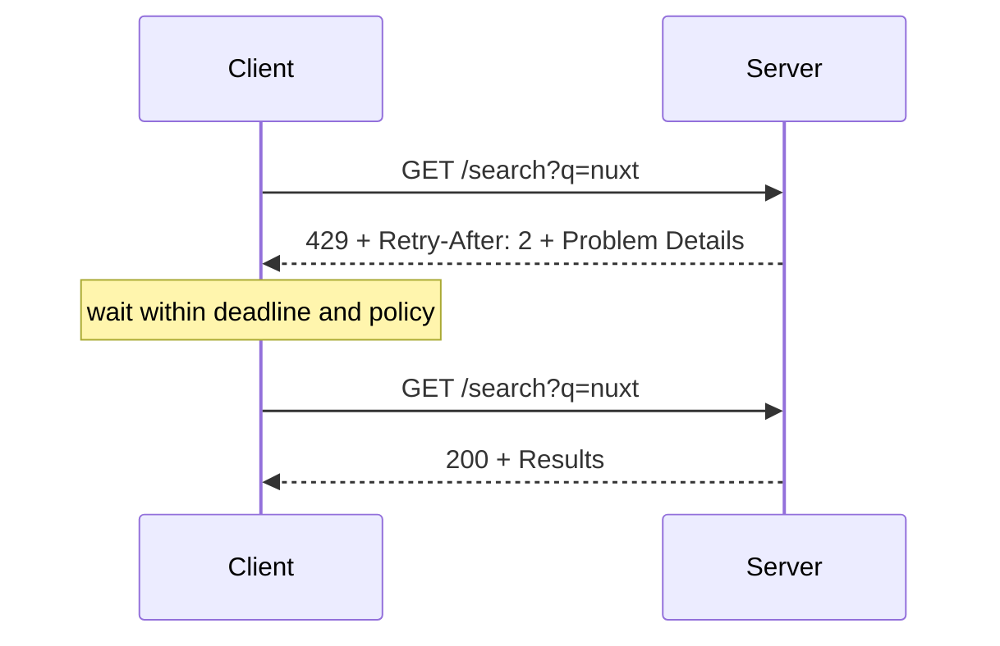

# Rate limiting and Retry-After

Status: proposed parser/classifier first, automatic retry deferred.

## 1. Pattern overview

A server returns `429 Too Many Requests` when a caller exceeded a request
policy. It may include `Retry-After` to tell the caller when a later attempt is
appropriate. This is useful for public APIs, expensive search or AI operations,
login protection, and shared upstream quotas.



[RFC 6585 section 4](https://www.rfc-editor.org/rfc/rfc6585.html#section-4)
defines `429` and permits `Retry-After`. [RFC 9110 section
10.2.3](https://www.rfc-editor.org/rfc/rfc9110.html#name-retry-after) defines
`Retry-After` as either an HTTP-date or a non-negative integer number of
seconds. Rate-limit budget headers remain active IETF work as of this review;
they are not part of this initial profile.

## 2. HTTP contract

```text
any operation subject to a rate policy

429 Too Many Requests
Retry-After: optional by RFC; required for NE automatic-delay capability
Content-Type: application/problem+json (recommended NE profile)
body: typed rate-limit Problem Details
```

The service must document the scope of a limit (credential, user, tenant,
origin, route, or shared pool) and whether a retry is useful. RFC 6585 does not
define how requests are counted or users identified.

A `429` does not make the original method safe to replay. Automatic retry is
allowed only for a safe/idempotent method or an unsafe method whose contract
provides idempotency. The client must cap both delay and total attempts and
respect its wall-clock deadline.

## 3. Server-side API proposal

Rate limiting commonly happens in middleware, before a route handler. Its
response belongs in NE's existing global/path/method response overlay rather
than being copied into every endpoint:

```ts
export default defineServerRouteConfig({
  '/api/**': {
    responses: {
      429: RateLimitProblem,
    },
    rateLimit: {
      retryAfter: 'required',
    },
  },
})
```

The exact `rateLimit` marker is a proposal. The response schema should use
`application/problem+json`; the contract needs a way to declare the required
`Retry-After` response header alongside the overlay.

A runtime `rateLimited({ retryAfter, detail, ...extensions })` response
constructor is worthwhile for NE-aware middleware. It serializes valid
`Retry-After`, sets status/content type, and builds the declared Problem
Details body. NE should not implement counters, token buckets, or distributed
rate-limit storage.

## 4. Server conformance

TypeScript can ensure the overlay includes `429`, a compatible Problem Details
body, and—when automatic delay is advertised—a `Retry-After` header contract.
It can restrict automatic mutation retry to an idempotent capability.

The response constructor can validate integer seconds or generate an HTTP-date
and prevent negative values. Final response validation can check middleware
responses only if the framework exposes a response-finalization boundary that
NE actually observes. Until then, middleware not using the constructor cannot
be claimed runtime-conformant.

Types cannot prove the fairness, accuracy, or distributed atomicity of the
limiter, nor that a server will have capacity after the advised time.

## 5. Client-side raw usage

```ts
const result = await $endpoint('/api/search', {
  method: 'get',
  query: { q: 'nuxt' },
})

if (result.status === 429) {
  const retryAfter = result.headers.get('retry-after')
  result.body // typed rate-limit Problem Details
}
```

Raw `$endpoint` must keep returning `429` as typed data. Merely declaring the
pattern must not silently sleep or retry every caller.

## 6. Invocation Strategy

The reusable low-level piece is a strict classifier:

```text
input: status-aware result + request capability + now/deadline
429 with valid Retry-After: retryable at computed instant
429 without/invalid Retry-After: fallback policy or terminal result
non-429: ordinary terminal result
```

Parsing rules include integer seconds, HTTP-date, past dates as zero delay,
clock skew tolerance, invalid values, a maximum accepted delay, and abortable
waiting. Backoff/jitter can be used only as an explicit fallback when the
server provides no usable value.

For GET/HEAD, the endpoint's method is enough to permit replay. For mutation,
the endpoint type must prove idempotency and the invocation must retain the
same key. The strategy must distinguish retry attempts from a new logical
action.

## 7. Pinia Colada integration

Only one layer may schedule retries. The preferred adapter turns a retryable
`429` into a typed protocol signal carrying:

- the original status-aware result;
- computed delay/deadline;
- whether replay is contractually safe.

Pinia Colada's
[retry plugin](https://pinia-colada.esm.dev/plugins/official/retry.html) can
return a millisecond delay from its retry callback. The NE adapter can provide
that callback, while Colada owns the timer and cancellation. If the final
signal is exposed as Colada `error`, it must retain the typed `429` result so
callers do not lose HTTP information.

For environments without the plugin, a standalone NE strategy may own the
loop, but its Colada options must then disable Colada retry. Never enable both.

## 8. Existing implementations

- RFC 6585 defines `429` but deliberately leaves identification and counting
  policy unspecified. RFC 9110 defines the stable `Retry-After` grammar.
- The IETF HTTPAPI working group has an active RateLimit header-fields draft;
  adopting its evolving budget fields should be a separate decision.
- Smithy marks errors `@retryable(throttling: true)` and says otherwise unsafe
  operations can be retried only with idempotency or protocol-specific hints.
- Misina parses `Retry-After`, caps server delays, applies fallback backoff and
  jitter, and separately parses several draft/vendor budget headers. It owns
  its retry loop, whereas NE must coordinate with Colada.
- Pinia Colada's retry plugin already owns attempt state and delayed scheduling;
  it expects a rejected error/signal rather than a status-aware data branch.
- TypeSpec, OpenAPI, Hono, and ts-rest can describe or emit `429` and headers,
  but do not by themselves establish safe replay of an unsafe mutation.

## 9. Recommendation

| Criterion          | Assessment                                                    |
| ------------------ | ------------------------------------------------------------- |
| Frequency          | High for external APIs; medium for ordinary Nuxt applications |
| HTTP-native value  | Very high for 429/Retry-After                                 |
| Type-safety value  | High when composed with idempotency/safe methods              |
| Server DX          | Medium; limiter implementation remains external               |
| Client DX          | High when delay parsing and replay safety are centralized     |
| Colada integration | High, but result-to-error mapping needs care                  |
| Complexity         | Medium for parser; high for complete adapter semantics        |
| Alternatives       | ofetch hooks, Colada retry callback, API gateway SDKs         |

**Priority: Medium.** Add strict `Retry-After` parsing/classification as a
portable internal primitive when another pattern needs it. Do not make
automatic retry the first new vertical slice, and do not put limiter storage in
NE core.
