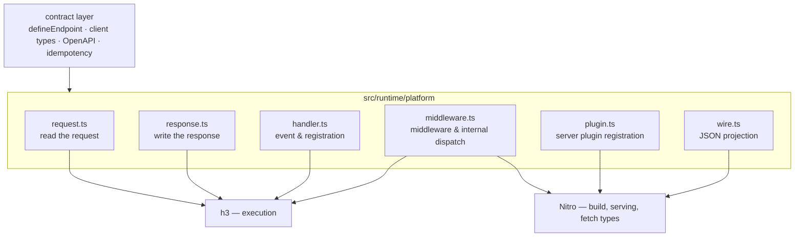

# The platform seam

Everything this runtime needs from [h3](https://github.com/h3js/h3) and
[Nitro](https://github.com/nitrojs/nitro) lives in this directory. Nothing
outside it imports either package; `test/platform-isolation.test.ts` pins that
boundary.

Until 0.7.x this was two files, `src/runtime/h3-adapter.ts` and
`src/runtime/wire.ts`; they are split by role so that each file answers one
question about the platform.

| File            | Role                                                                    |
| --------------- | ----------------------------------------------------------------------- |
| `request.ts`    | Query, headers, and the four body shapes a contract can declare         |
| `response.ts`   | The status and headers a declared contract resolves to; internal errors |
| `handler.ts`    | The `RuntimeEvent` alias, handler registration, method dispatch input   |
| `middleware.ts` | Middleware registration, internal dispatch, and redirects — the bridge  |
| `plugin.ts`     | The platform-specific server plugin constructor                         |
| `wire.ts`       | What a handler return looks like after JSON serialization               |

## Prototype responsibility split

This branch tests the future boundary directly:

- H3 owns the route-contract shape and shared request/response validation.
- Nitro recognizes the H3 macro, provides the registry, and generates types.
- fetchdts resolves fields without owning status-aware semantics.
- NE keeps status-aware endpoint requests, OpenAPI, idempotency, Effect, and Query integration.

`request.ts` now contains transport adaptation only: preserving repeated query
values, normalizing H3's query container to a plain record, and reading
media-type-specific bodies. Validation semantics delegate to H3.

NE owns the concise `defineEndpoint({ request, responses, handler })` authoring
shape. This compatibility line evaluates and normalizes that declaration
itself while keeping the resulting HTTP contract aligned with the Nuxt 5 line.
