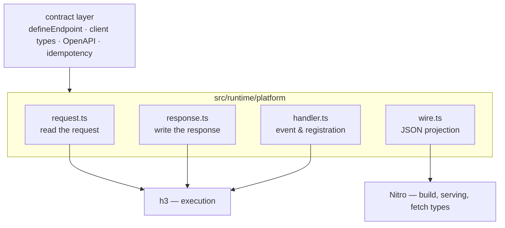

# The platform seam

Everything this runtime needs from [h3](https://github.com/h3js/h3) and
[Nitro](https://github.com/nitrojs/nitro) lives in this directory. Nothing
outside it imports either package, with one documented exception —
`../server-plugin.ts` uses `defineNitroPlugin` to register startup logic, and
moving 195 lines of bootstrapping here would bury the seam in it.
`test/platform-isolation.test.ts` pins both statements.

Until 0.7.x this was two files, `src/runtime/h3-adapter.ts` and
`src/runtime/wire.ts`; they are split by role so that each file answers one
question about the platform.

| File          | Role                                                                    |
| ------------- | ----------------------------------------------------------------------- |
| `request.ts`  | Query, headers, and the four body shapes a contract can declare         |
| `response.ts` | The status and headers a declared contract resolves to; internal errors |
| `handler.ts`  | The `RuntimeEvent` alias, handler registration, method dispatch input   |
| `wire.ts`     | What a handler return looks like after JSON serialization               |

## What core absorbs, predicted

Grades, most-certain first:

- **A — core already ships it.** Present in h3 v2 / Nitro 3 today. For most
  rows delegation is just adopting that major; where it is gated, the row says
  by what.
- **B — core has it on paper.** An open RFC or PR proposes it.
- **C — nowhere yet, but the boundary fits.** A small addition, and some layer
  other than this module is its natural home.
- **D — stays here.** Nothing in core points at it, and the boundary argues it
  belongs downstream.

| Capability                                                          | Grade | Evidence                                                                                                                                                                                                                                                                                                      |
| ------------------------------------------------------------------- | ----- | ------------------------------------------------------------------------------------------------------------------------------------------------------------------------------------------------------------------------------------------------------------------------------------------------------------- |
| Handler registration, Web request, method (`handler.ts`)            | A     | Pass-throughs today; on v2, `toWebRequest(event)` becomes the `event.req` property, while `defineEventHandler` and `event.method` still resolve                                                                                                                                                               |
| body / headers / query validation execution (`request.ts`)          | A     | h3 v2 `defineValidatedHandler`, async on all three since [h3#1491](https://github.com/h3js/h3/pull/1491); adopting it here waits on the two B rows below                                                                                                                                                      |
| Internal error shape (`response.ts`)                                | A     | `HTTPError` in v2; only this module's internal 500s throw, so the v2 wire-shape change stays contained                                                                                                                                                                                                        |
| `Serialize`/`Simplify` on Nitro 3 (`wire.ts`)                       | A     | Still exported from `nitro/types`; the migration is an import path                                                                                                                                                                                                                                            |
| params validation                                                   | B     | [h3#1501](https://github.com/h3js/h3/pull/1501), open                                                                                                                                                                                                                                                         |
| A home for validated values that survives coercion                  | B     | h3#1501's own comment defers typing coerced values to [h3#1437](https://github.com/h3js/h3/issues/1437); [h3#1502](https://github.com/h3js/h3/pull/1502) drafts `event.validated.*`. Until something lands, the context object built on top of `request.ts` is what keeps `z.coerce.number()` output a number |
| Response contract (declared statuses as a slot)                     | B     | Proposed in h3#1437; the maintainer reply there scopes near-term work to async validators and params                                                                                                                                                                                                          |
| A fetchdts-based wire projection (`wire.ts`)                        | B     | [nitro#2758](https://github.com/nitrojs/nitro/issues/2758), open                                                                                                                                                                                                                                              |
| JSON Schema conversion                                              | C     | Nothing in h3 or Nitro; the natural home is the validator layer (`~standard.jsonSchema` on Standard Schema), at which point this module's converters retire too                                                                                                                                               |
| Multipart and raw-byte bodies (`request.ts`)                        | D     | v2's JSON validation wraps the body in a proxy that throws on `.text`/`.formData`/`.body` ("Cannot access … with JSON validation enabled", `src/utils/internal/validate.ts` on h3 main); media-type-map contracts need exactly those reads                                                                    |
| Executing a declared status — code, headers, `Vary` (`response.ts`) | D     | Which status and headers a declaration resolves to is decided by the layer that owns the declaration                                                                                                                                                                                                          |
| Status-discriminated client results                                 | D     | fetchdts types one response per route and method, with no per-status key — so narrowing on `status` lives above this seam, in `client.ts`                                                                                                                                                                     |

Beyond this directory, for completeness: OpenAPI derivation from schemas,
the TanStack Query factories, the composables, and idempotency are all graded
D — h3#1437 explicitly leaves the typed client, the codegen, and OpenAPI
generation downstream, and Nitro's OpenAPI route reads hand-written
`meta.openAPI` rather than schemas.

## Slot correspondence with h3 v2

The flat authoring shape here and h3 v2's nested `validate:` differ on purpose:
`defineValidatedHandler` is still marked `@experimental` and appears nowhere in
h3's own docs, so restructuring a public API to match it would risk matching a
moving target. The mapping is mechanical, and this is it:

| This module                                                      | h3 v2 `defineValidatedHandler`                                                              |
| ---------------------------------------------------------------- | ------------------------------------------------------------------------------------------- |
| `params`                                                         | `validate.params` ([h3#1501](https://github.com/h3js/h3/pull/1501), open)                   |
| `query`                                                          | `validate.query`                                                                            |
| `headers`                                                        | `validate.headers`                                                                          |
| `body` (single schema)                                           | `validate.body`                                                                             |
| `body` (media-type map)                                          | no equivalent — see the grade-D row above                                                   |
| `responses`                                                      | proposed as a `validate.response` slot in [h3#1437](https://github.com/h3js/h3/issues/1437) |
| `onValidationError`                                              | `validate.onError`                                                                          |
| `handler`                                                        | `handler`                                                                                   |
| `operation` / `summary` / `description` / `tags` / `idempotency` | no counterpart — contract metadata, not validation                                          |

If core stabilises the nested shape — `@experimental` dropped, documented —
revisiting the authoring shape against this table is the intended move.

## Four independent events

Each of these lands on this directory separately; none blocks another.

1. **This package adopts h3 v2.** One call disappears (`toWebRequest` →
   `event.req`); every other h3 name this directory imports still resolves.
2. **This package adopts Nitro 3.** Package rename (`nitropack` → `nitro`),
   import paths, and `defineNitroPlugin` → `definePlugin` in
   `../server-plugin.ts`. `wire.ts` keeps its body.
3. **Core absorbs validation execution.** Needs a home for validated values
   first (the B rows above); then `request.ts` thins to the reads core cannot
   hold.
4. **fetchdts lands.** `wire.ts` is rewritten against it; status
   discrimination stays in `client.ts` either way.

The per-call migration tables — every import in this directory mapped to its
v2/v3 form, dated and pinned to the release candidates they were measured
against — are in
[`docs/nitro-v3-h3-v2-readiness.md`](../../../docs/nitro-v3-h3-v2-readiness.md).
